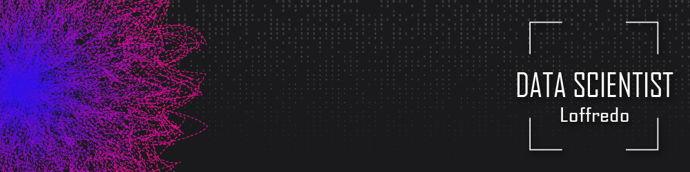

  

  
  
  
  
  

 

# Raffaela Loffredo

_Master in Environmental Management from Positivo University and Bachelor of Law from UniCuritiba_

Throughout my career, I have worked in different types of companies such as NGOs, governments, start-ups, and multinationals. As a result, I have a vast knowledge of business that helps me as a data scientist to more easily identify and solve problems. I also find points that minimize costs and create models that increase revenues, in order to extract meaningful information that assists in decision-making and makes the company more profitable. For this, I always seek to improve my knowledge in business, data analysis, and data visualization to build better analytical models and present them in increasingly sophisticated reports.
 
 

**Background** 
 
Statistics
—  Data Visualization
—  Academic Research
 
 

**Tools**
 
Jupyter Notebook
—  Pandas
—  Numpy
—  Matplotlib
—  Seaborn
—  Scikit-Learn
—  Tensor Flow
—  Keras
—  Advanced Excel
—  SQL
—  Power BI
—  Tableau
—  Looker
 
 

## Projects
### Machine Learning Techniques
* **[Credit card fraud detection](https://github.com/raffaloffredo/fraud_detection)**
 

### Data Exploring, Cleaning, and Visualization
* **[An updated study of COVID-19 in Brazil and the world](https://github.com/raffaloffredo/covid_2023)**
* **[Airbnb Data Analysis for New York City](https://github.com/raffaloffredo/airbnb_new_york)**
 

### Power BI
* **[Logistic Dashboard](https://github.com/raffaloffredo/dashboard_logistica)**
* **[Human Resources Dashboard](https://github.com/raffaloffredo/dashboard_rh)**
* **[Commercial Dashboard](https://github.com/raffaloffredo/dashboard_comercial)**
* **[Marketing Dashboard](https://github.com/raffaloffredo/dashboard_marketing)**
* **[Sales Dashboard](https://github.com/raffaloffredo/dashboard_vendas)**
* **[Global Sales Dashboard](https://github.com/raffaloffredo/dashboard_vendas_globais/)**
 

## Articles

* **[8 reasons why you should learn Python & 2 top courses to start your journey today!](https://www.linkedin.com/pulse/8-reasons-why-you-should-learn-python-2-top-courses-start-loffredo/)**
* **[Margarine consumption leads to divorce!](https://www.linkedin.com/pulse/margarine-consumption-leads-divorce-raffaela-loffredo/)**
* **[5 Organization tools + 1 Extra infallible tip to help you accomplish your goals!](https://www.linkedin.com/pulse/5-organization-tools-1-extra-infallible-tip-help-you-your-loffredo/)**
* **[7 lessons I learned from the book: The Ascent of Money](https://www.linkedin.com/pulse/7-lessons-i-learned-from-book-ascent-money-raffaela-loffredo/)**
* **[How to achieve your goals?](https://medium.com/@loffredo.ds/how-to-achieve-your-goals-9e5aa7de8a2d)**
*  **[Do you know the best way to show your results? Get to know the top 5 ways to present data!](https://www.linkedin.com/pulse/do-you-know-best-way-show-your-results-get-top-5-ways-loffredo/)**
*  **[_Complete_ Article about COVID-19 project](https://medium.com/@loffredo.ds/data-science-applied-a-covid-19-study-on-brazil-and-the-world-8376407cc672)**
*  **[_Summarized_ Article about COVID-19 project](https://www.linkedin.com/pulse/updated-study-covid-19-brazil-worldwide-raffaela-loffredo/)**
*  **[How do banks create money?](https://www.linkedin.com/pulse/how-do-banks-create-money-raffaela-loffredo/)**
*  **[Construction of machine learning models to predict credit card fraud](https://medium.com/@loffredo.ds/construction-of-machine-learning-models-to-predict-credit-card-fraud-e926fca4229c)**
*  **[Results obtained with machine learning models to predict credit card fraud](https://www.linkedin.com/pulse/results-obtained-machine-learning-models-predict-credit-loffredo/)**
 

* **[Como a ciência de dados pode tornar a sua empresa mais lucrativa?](https://www.linkedin.com/pulse/como-ci%25C3%25AAncia-de-dados-pode-tornar-sua-empresa-mais-raffaela-loffredo/?trackingId=9KS4PEk0S%2Few5%2B0GHC47Uw%3D%3D)**
* **[Afinal, quais as diferenças entre engenheiro, analista e cientista de dados?](https://www.linkedin.com/pulse/afinal-quais-diferen%25C3%25A7as-entre-engenheiro-analista-e-de-loffredo/?trackingId=9KS4PEk0S%2Few5%2B0GHC47Uw%3D%3D)**
* **[Cambridge Analytica x Privacidade dos Dados](https://www.linkedin.com/pulse/cambridge-analytica-x-privacidade-dos-dados-raffaela-loffredo%3FtrackingId=S2IB9pN%252BSQaxwbYtj6q8Hg%253D%253D/?trackingId=S2IB9pN%2BSQaxwbYtj6q8Hg%3D%3D)**
* **[O que suas compras online tem a ver com o Teorema de Pitágoras?](https://www.linkedin.com/pulse/o-que-suas-compras-online-tem-ver-com-teorema-de-raffaela-loffredo/)**
* **[Uniswap V3: uma jogada de mestre](https://www.linkedin.com/pulse/uniswap-v3-uma-jogada-de-mestre-raffaela-loffredo-gutierrez/)**
* **[8 razões porque você deveria aprender Python e 2 cursos fantásticos para começar seu aprendizado ainda hoje!](https://medium.com/@loffredo.ds/8-raz%C3%B5es-por-qu%C3%AA-voc%C3%AA-deveria-aprender-python-e-2-cursos-fant%C3%A1sticos-para-come%C3%A7ar-seu-aprendizado-f6a57fc39d82)**
* **[Blockchain e criptomoedas podem ser implementadas em sistemas públicos?](https://medium.com/@loffredo.ds/curso-defi-aula-8-fcf754d23455)**
* **[7 aprendizados do livro: A Ascensão do dinheiro](https://medium.com/@loffredo.ds/7-aprendizados-do-livro-a-ascens%C3%A3o-do-dinheiro-79cb37b7de6a)**
* **[5 Ferramentas de organização + 1 dica extra infalível para ajudar você a conquistar seus objetivos!](https://medium.com/@loffredo.ds/5-ferramentas-de-organiza%C3%A7%C3%A3o-1-dica-extra-infal%C3%ADvel-para-ajudar-voc%C3%AA-a-conquistar-seus-objetivos-a90dcb1505c4)**
* **[Como atingir os seus objetivos?](https://www.linkedin.com/pulse/como-atingir-os-seus-objetivos-raffaela-loffredo/)**
* **[Crie a sua criptomoeda em menos de 7 minutos!](https://www.linkedin.com/pulse/crie-sua-criptomoeda-em-menos-de-7-minutos-raffaela-loffredo/)**
* **[O consumo de margarina causa divórcio!](https://medium.com/@loffredo.ds/o-consumo-de-margarina-causa-div%C3%B3rcio-e5c2771f341f)**
* **[Você sabe a melhor forma de mostrar os seus resultados? Conheça as 5 principais maneiras de apresentar dados!](https://medium.com/@loffredo.ds/você-sabe-a-melhor-forma-de-mostrar-os-seus-resultados-7c2cc09ed499)**
*  **[Artigo _completo_ do projeto sobre COVID-19](https://medium.com/@loffredo.ds/ci%C3%AAncia-de-dados-aplicada-estudo-sobre-o-covid-19-no-brasil-e-no-mundo-e4a8996a75ab)**
*  **[Artigo _resumido_ do projeto sobre COVID-19](https://www.linkedin.com/pulse/estudo-atualizado-do-covid-19-brasil-e-nomundo-raffaela-loffredo/)**
*  **[Como criar um gráfico animado com o Bar Chart Race](https://medium.com/@loffredo.ds/como-criar-um-gr%C3%A1fico-animado-com-o-bar-chart-race-878a0e693246)**
*  **[Precisa de motivação para estudar? Veja isso!](https://www.linkedin.com/pulse/precisa-de-motiva%25C3%25A7%25C3%25A3o-para-estudar-veja-isso-raffaela-loffredo/)**
*  **[Canvas de Carreira: um poderoso aliado para atingir seus objetivos profissionais](https://www.linkedin.com/pulse/canvas-de-carreira-um-poderoso-aliado-para-atingir-seus-loffredo/?trackingId=7hs4XJQtSoampdb%2F1pbbsQ%3D%3D)**
*  **[Como os bancos criam dinheiro?](https://medium.com/@loffredo.ds/como-os-bancos-criam-dinheiro-53acfe4ecd76)**
*  **[Construção de modelos de machine learning para prever fraude em cartão de crédito](https://medium.com/@loffredo.ds/constru%C3%A7%C3%A3o-de-modelos-de-machine-learning-para-prever-fraude-em-cart%C3%A3o-de-cr%C3%A9dito-fde010b534db)**
*  **[Resultados obtidos com modelos de machine learning para prever fraude em cartão de crédito](https://www.linkedin.com/pulse/resultados-obtidos-com-modelos-de-machine-learning-para-loffredo/)**

 
 

## Let's Talk
* [Website](https://sites.google.com/view/loffredo/)
* [LinkedIn](https://www.linkedin.com/in/raffaela-loffredo/?locale=en_US)
* [Medium](https://medium.com/@loffredo.ds)
* [Instagram](https://www.instagram.com/loffredo.ds/)
